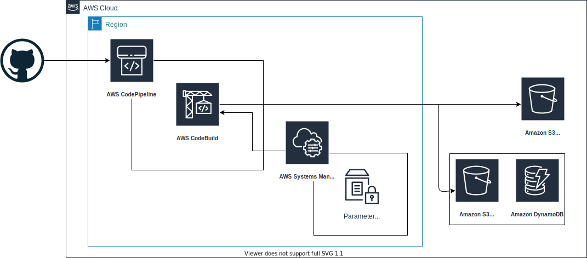
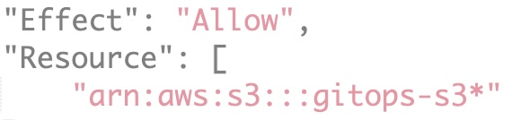
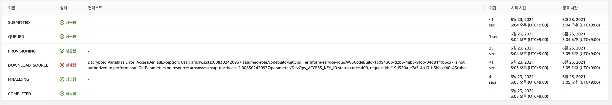

# **GitOps CI/CD PipeLine**
## **Overview**


`Terraform` 코드를 `CI/CD`파이프 라인을 통해서만 배포할수 있게 셋팅해야함.\
`CI/CD`를 이용해 반영된 내용은 `S3 for .tfstate`로 업로드 됨.\
`.tfstate`의 무결성을 보장하기 위해 쓰기요청 발생시 `DynamoDB`를 이용해 `Lock`을 달성함.
Local에 저장된 `AWS_ACCESS_KEY_ID`, `AWS_SECRET_ACCESS_KEY`는 `AWS SSM`을 이용해 관리.

---

## **How to Implement**
### **S3 셋팅**
>
>
>`.tfstate`파일을 저장하고 무결성을 달성하기 위한 `S3`와 `DynamoDB`를 셋팅.\
>`artifact`를 저장하기 위한 `S3`를 셋팅함.
>> **policy.json**
>>```
>>{
>>    "Version": "2012-10-17",
>>    "Id": "SSEAndSSLPolicy",
>>    "Statement": [
>>        {
>>            "Sid": "DenyUnEncryptedObjectUploads",
>>            "Effect": "Deny",
>>            "Principal": "*",
>>            "Action": "s3:PutObject",
>>            "Resource": "arn:aws:s3:::gitops-s3/*",
>>            "Condition": {
>>                "StringNotEquals": {
>>                    "s3:x-amz-server-side-encryption": "aws:kms"
>>                }
>>            }
>>        },
>>        {
>>            "Sid": "DenyInsecureConnections",
>>            "Effect": "Deny",
>>            "Principal": "*",
>>            "Action": "s3:*",
>>            "Resource": "arn:aws:s3:::gitops-s3/*",
>>            "Condition": {
>>                "Bool": {
>>                    "aws:SecureTransport": "false"
>>                }
>>            }
>>        }
>>    ]
>>}
>>```
>#### **결과 확인**
> **S3**
>
>
>
> **DynamoDB**
>
>
>
### **AWS System Manager - Parameter Store**
>
>
> `CodeBuild`시에 필요한 `AWS_ACCESS_KEY_ID`, `AWS_SECRET_ACCESS_KEY`를 `AWS System Manager`의 `Parameter Store`를 이용해 등록함.
>#### **결과 확인**
>**Parameter Store**
>
>
>정상적으로 `AWS_ACCESS_KEY_ID`, `AWS_SECRET_ACCESS_KEY`가 등록된 것을 확인.
### **CodePipeLine & CodeBuild**
>
>
>기존에 사용하던 역할이 있을 경우 `기존 서비스 역할`로 선택.\
>아티팩트 스토어의 경우 세부적인 세팅이 어렵다면 `기본 위치` 나는 따로 관리하기 위해 `사용자 지정 위치` 선택
>
>
>
>소스 스테이지에서는 본인이 사용할 `SSOT`의 리파지토리와 브렌치를 결정해야함.
> ### **CodeBuild**
>> 
>>
>> `DynamoDB`를 이용해 `.tfstate`파일에 대한 락을 확보 했으나 추가적으로 동시 빌드를 한개로 제한.
>>
>> 
>>
>> 이미지는 `hashicorp`에서 제공해주는 `Terraform Container image`를 사용함.\
>> 기존에 사용하던 역할이 있으면 `기존 서비스 역할` 선택.
>>
>> 
>>
>> `buildspec.yml`파일은 다양하게 구현함.\
>> 나는 테스트를 위해 `buildspec_apply.yml`, `buildspec_destroy.yml`를 작성.\
>>**buildspec_apply.yml**
>>```
>>version: 0.2
>>env:
>>  parameter-store:
>>    AWS_ACCESS_KEY_ID: "DevOps_ACCESS_KEY_ID"
>>    AWS_SECRET_ACCESS_KEY: "DevOps_SECRET_ACCESS_KEY"
>>phases:
>>  pre_build:
>>    commands:
>>      - echo Terraform init
>>      - terraform init
>>      - env
>>  build:
>>    commands:
>>      - echo Terraform apply....
>>      - terraform apply -auto-approve
>> ```
>>**buildspec_destroy.yml**
>>```
>>version: 0.2
>>env:
>>  parameter-store:
>>    AWS_ACCESS_KEY_ID: "DevOps_ACCESS_KEY_ID"
>>    AWS_SECRET_ACCESS_KEY: "DevOps_SECRET_ACCESS_KEY"
>>phases:
>>  pre_build:
>>    commands:
>>      - terraform init
>>      - terraform refresh
>>      - env
>>  build:
>>    commands:
>>      - echo Terraform destroy....
>>      - terraform destroy -auto-approve
>>```
>
>
> 빌드 프로젝트를 선택함.
>
>
>
> 최종적 검토 단계에서 마지막으로 확인함.
## **TroubleShooting**
> 
>
> `CLIENT_ERROR`로 `S3`에서 `SourceArti`를 가져올수 없는것을 확인함.\
> 이 문제는 처음에 생성된 기본 정책에서 특정 `S3`의 권한이 없기 때문임.
>
> 
>
> 해당 정책을 보면 `codepipeline-ap-northeast-2-*`로 셋팅된 것을 확인할수 있음.\
> `CodePipeLine`생성시 아티팩트 저장소를 기본위치로 사용하면 문제 없지만 사용자 지정위치로 사용할 경우 수정이 필요함.
>
> 
>
> 변경후 다시 한번 빌드를 실행.
> 
>
> `codebuild-GitOps_Terraform-service-role`에 `SSM`에 대한 권한이 없어 에러가 발생하는 것을 확인.\
> `Build`환경안에서 위에 설정했던 `Parameter-Store`의 값을 가져오는 부분에서 발생한 문제.
>
> 
>
> `codebuild-GitOps_Terraform-service-role`에 `SSM`에 대한 읽기 권한을 추가함.
## **BuildResult**
> 
>
> 위의 트러블슈팅 과정 이후 빌드를 실행하면 정상적으로 빌드 되는것을 확인할수 있음.
>
> 
>
> `Build`환경 내에서 `Terraform`이 정상적으로 작동하는것을 확인 할 수 있음.
>
> 
>
> 빌드 이후 `S3`에도 `.tfstate`파일이 잘 반영된것을 확인.
>
> 
> 
>
> `Build`의 결과인 `VPC`와 `Subnet`이 잘 만들어진 것을 확인 할 수 있음.
## **개선해야할 점**
예전에 학습하며 미흡하다고 생각했던 `csv`에 담겨있는 `key`를 `ssm`을 이용해 관리할 수 있어 유익했습니다.\
하지만 제일 핵심인 온전한 `GitOps`를 위해서는 빌드지점 외에서 발생한 인스턴스를 제거하는 방법이 필요한데 이 점을 충족하지 못했습니다.\
그리고 빌드결과 알림을 보내주는 장치등 아직 미흡함이 있어서 추가적인 학습으로 향후에 보완하도록 하겠습니다.
## **마치며**
`buildspec_destroy.yml`을 이용해 `Terraform`으로 생성된 인스턴스를 제거하는것은 이 글을 읽는 사람들에게 맡기겠습니다.\
또한 실습에 필요한 `.tf`파일은 tf폴더에 같이 첨부합니다.