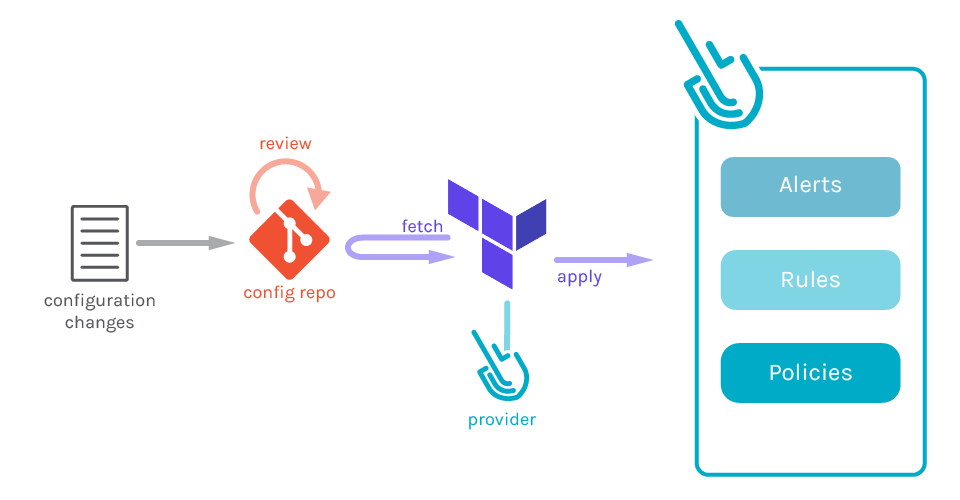
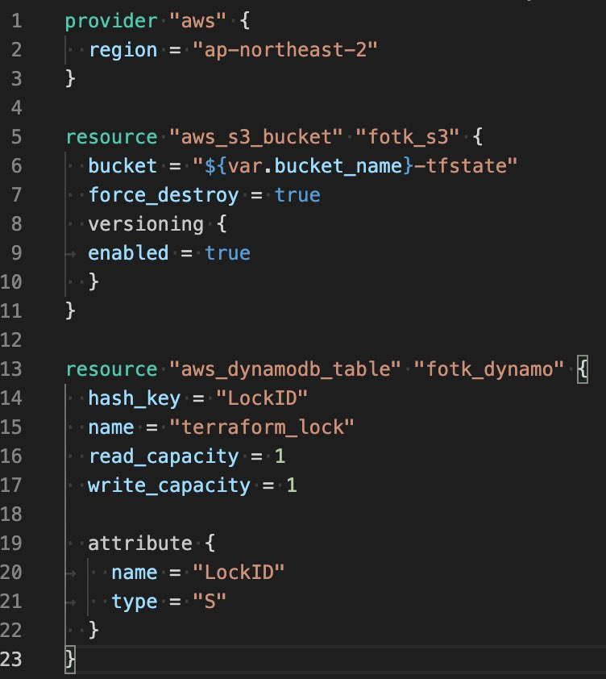
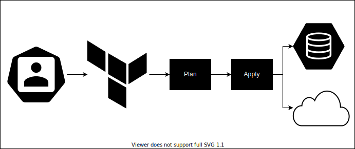
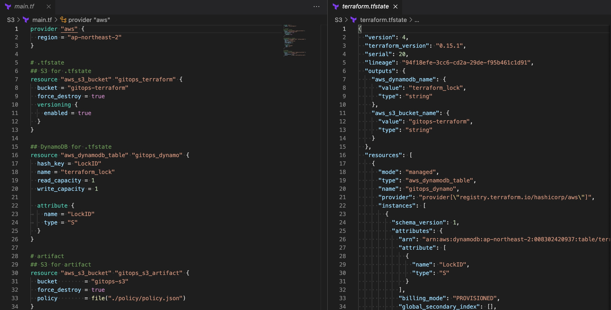
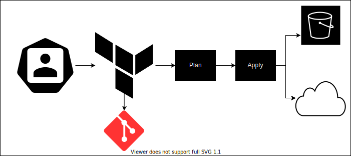
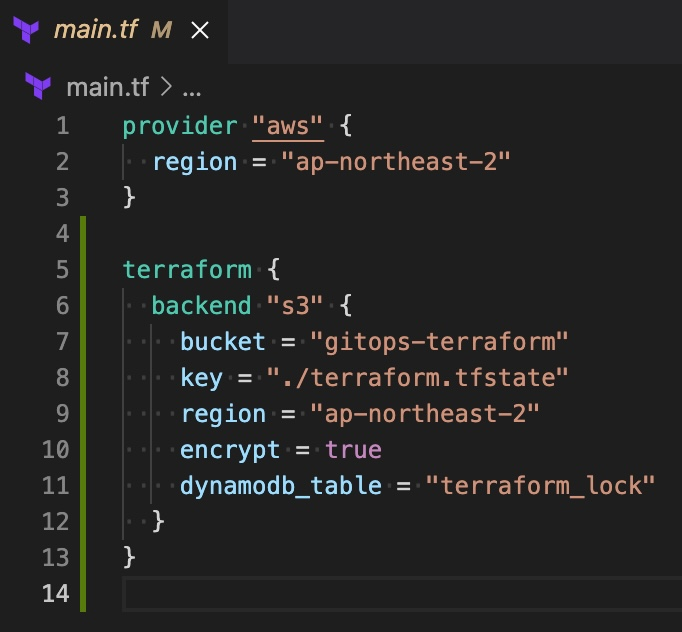
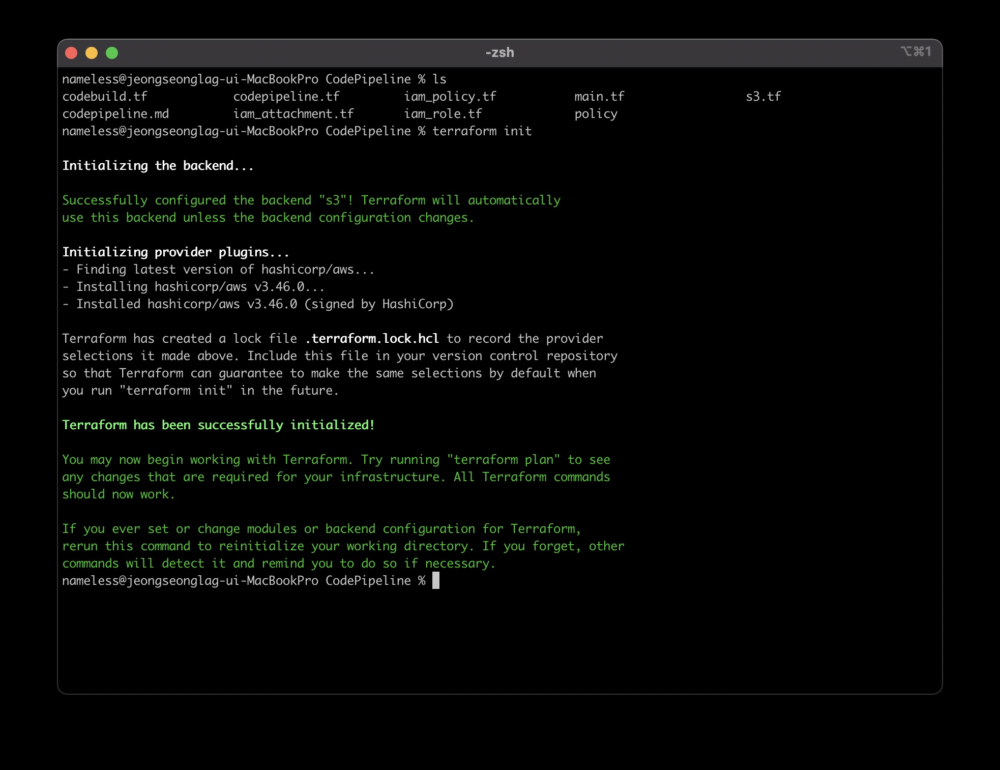
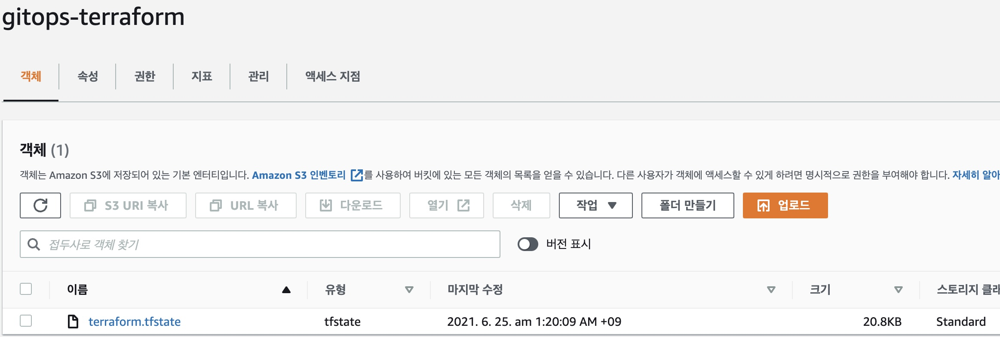
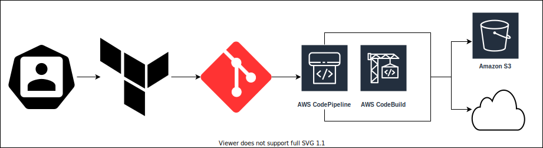
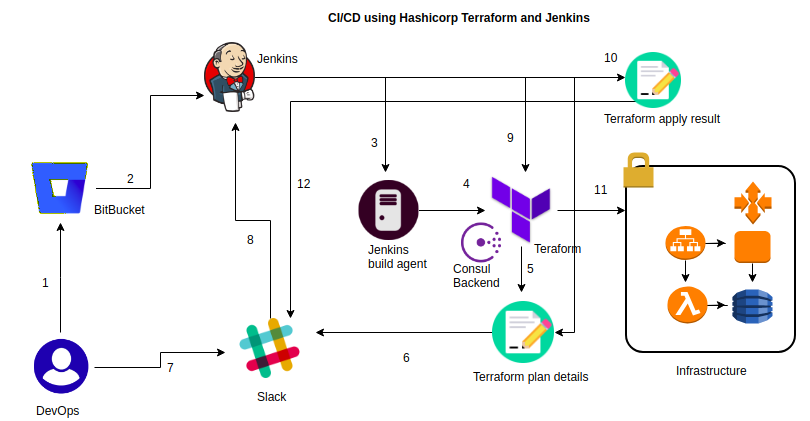

# **GitOps**
## **Overview**


현재 `Sparta42`의 일부 인프라는 `IaC`인 `Terraform`을 이용해 관리중.\
`Terraform`으로 작성된 코드는 지정 저장소로 `Push`됨.

---
## **What is GitOps?**
`GitOps`는 제어 시스템의 오픈소스 버전인 `Git`을 사용해 인프라 및 애플리케이션 구성을 관리하기 위한 일련의 방법.\
`GitOps`는 `Git`을 선언적 인프라 및 애플리케이션에 대한 `단일 진실 공급원(Single Source Of Truth, SSOT)`로 사용하는 방식으로 작동.

---
## **Reson for Introduction**
`Ops`가 한명임으로 `Terraform`의 핵심인 `.tfstate`파일이 `Ops`의 로컬에서 관리중.\
추후 `Ops`인원이 늘어났을때 `.tfstate`파일의 안정적 관리를 위해 다양한 방법들을 고민함.\


이전에 사용했던 방법 `.tfstate`파일의 백업장소를 `AWS S3 Bucket`으로 지정한 후 `dynamoDB`를 이용해 `.tfstate`파일의 `lock`을 달성함.\
하지만 `Ops`가 여러명일때 항상 원격 `.tfstate`의 상태를 체크해야하고 `lock`이 걸려있는 동안 다른 인원의 `task`가 지연되는 경우가 발생함.\
이를 해결하기 위해 `Git`에 코드를 `Commit`하고 `CI/CD` 파이프라인을 이용해 인스턴스를 관리하는 방법을 도입 하려고 함.

---
## **What I Did**
각 단계는 저 스스로 생각해보며 순차적으로 개선해본 내용입니다.\
정답은 정해져 있지 않으며 자신에게 가장 적합한 방법을 도입하시길 바랍니다.
### **Phase1**
> 
>
> `Terraform`코드를 로컬에서 빌드하고 `.tfstate`를 로컬에 저장하는 경우
>
> **Directory 구조**
> ```
>├── .terraform
>│    └── providers
>│         └── registry.terraform.io
>│              └── terraform-provider-aws_v3.46.0_x5
>│
>├── .terraform.lock.hcl
>├── ~~.tf
>├── terraform.tfstate
>└── terraform.tfstate.backup
> ```
> 
> `.tf`에 선언한 내용들이 정상적으로 반영되고 로컬에 `.tfstate` 생성과 더불어 인스턴스의 정보가 저장됩니다.
>
> **장점**
> * 별도의 세팅 없이 `KEY_ID`, `SECRET_KEY`만 환경변수로 등록하면 바로 사용 할 수 있습니다.
>
> **단점**
>
> * `Ops`가 두명 이상이라면 `.tfstate`의 무결성을 보장할수가 없습니다.
> * `Provider`가 제공해주는 `KEY_ID`, `SECRET_KEY`가 필요한데 각 인원에게 배포하다보면 보안적으로 취약해질수 있습니다. 
### **Phase2**
> 
>
> `Terraform`코드를 로컬에서 빌드하고 `.tfstate`를 `S3`에 저장하는 경우
>
> **Directory 구조**
> ```
>├── .terraform
>│    └── providers
>│         └── registry.terraform.io
>│              └── terraform-provider-aws_v3.46.0_x5
>│
>├── .terraform.lock.hcl
>└── ~~.tf
>
> S3
> └── terraform.tfstate
> ```
> 
>
> `.tfstate`를 `S3`에 저장하기 위해선 `5~13`줄의 형태로 선언을 해야합니다.\
> 사전에 `S3`와 `DynamoDB`를 세팅하도록 합시다.
> 
>
> `terraform init`시 `backend`부분을 초기화 하는것을 확인 할 수 있습니다.
>
> 
> `terraform apply` 이후 `backend`에 등록했던 `S3`에 `.tfstate`가 생셩된것을 확인 할 수 있습니다.
>
> **장점**
> * Phase1에서 달성하지 못했던 `.tfstate`파일의 무결성을 `DynamoDB`를 통해 달성 할 수 있습니다.
>
> **단점**
> * 클라우드 환경을 사전에 세팅 해야하는 번거로움이 있습니다.
> * Phase1에서 가졌던 보안적 문제를 아직 해결하지 못했습니다.
> * `Human Error` 특히 코드를 빌드한 이후 공용 저장소로 푸시하지 않은 경우 `S3`에 저장된 `.tfstate`와 공용 저장소에 저장된 코드의 불일치가 발생합니다.
### **Phase3**
> 
>
> `Terraform`코드를 `CI/CD`를 이용해 빌드하고 `.tfstate`를 `S3`에 저장하는 경우
>
> **Directory 구조**
> ```
>└── ~~.tf
>
> S3
> └── terraform.tfstate
> ```
>[GitOps_CI/CD](./CI_CD_Pipeline/README.md)
>
> **장점**
> * `AWS SSM`을 이용해 Phase1, Phase2에서 각각의 `Ops`에게 나갔던 `Key`를 중앙에서 관리 할 수 있습니다.
> * 공용 저장소에 푸시된 코드만 파이프라인을 따라 빌드가 일어나기에 Phase2에서 `Human Error`로 인한 `.tfstate`와 공용 저장소에 저장된 코드의 불일치를 예방 할 수 있습니다.
>
> **단점**
> * 클라우드 환경을 사전에 세팅 해야하는 번거로움이 있습니다.
> * `IaC`에 능숙하지 않은 경우 테스크를 처리하는데 있어 상당한 시간을 소요하게 됩니다.
> * `IaC`가 아닌 `Console`을 통해 인스턴스를 생성할 경우 코드, `.tfstate`파일과 현재 클라우드 내의 인스턴스 요소의 불일치가 발생합니다.
### **Next Phase**
>
> 현재 Phase3 에서는 `plan`에 의한 계획 수립 없이 바로 `apply`를 수행합니다.
>
> **추가 해야할 프로세스**
>1. `plan`을 이용한 계획 수립, `plan`의 결과를 담당자에게 전송.
>1. 담당자가 `plan`의 결과를 기반으로 다시 `apply`의 과정을 진행.
>1. `apply`결과를 저장하고 `apply`결과를 다시 담당자에게 전송.