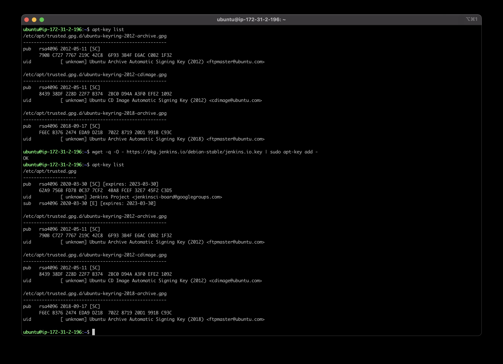
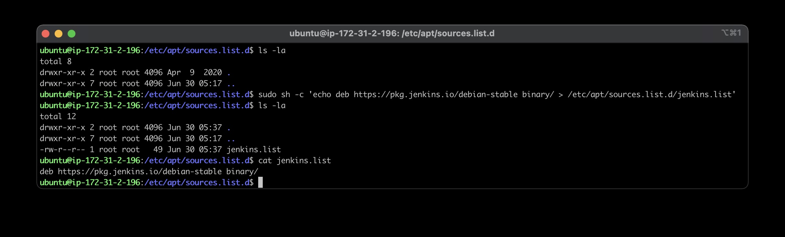
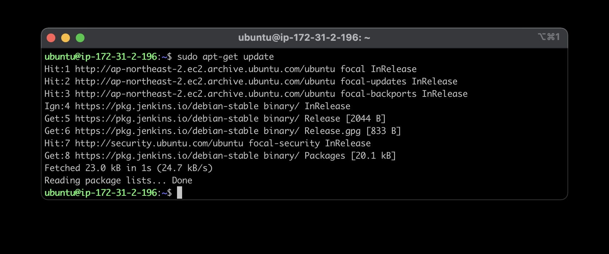
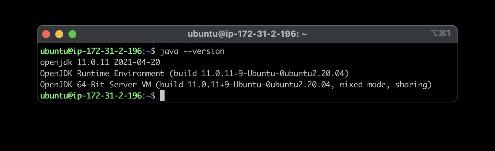

# **Jenkins_Install**
모든 서버환경은 `AWS Cloud`에 기반합니다.
## **Prerequisite**
---
### **Repositoy Key add**
> https://pkg.jenkins.io/
>
> 해당하는 리눅스에 맞게 명령어를 입력합니다. \
> 편집 주는 ubuntu `18.04`를 사용하고 있습니다.
>
>
>`wget -q -O - https://pkg.jenkins.io/debian-stable/jenkins.io.key | sudo apt-key add -` 입력합니다.\
> `OK`가 출력된다면 `apt-key list`를 통해 `list`를 확인해봅니다.
>```
>/etc/apt/trusted.gpg
>--------------------
>pub   rsa4096 2020-03-30 [SC] [expires: 2023-03-30]
>      62A9 756B FD78 0C37 7CF2  4BA8 FCEF 32E7 45F2 C3D5
>uid           [ unknown] Jenkins Project <jenkinsci-board@googlegroups.com>
>sub   rsa4096 2020-03-30 [E] [expires: 2023-03-30]
>```
> 정상적으로 키가 등록된것을 확인 할 수 있습니다.
### **Package Repository add**
>
>
> `sudo sh -c 'echo deb https://pkg.jenkins.io/debian-stable binary/ > /etc/apt/sources.list.d/jenkins.list'`입력합니다.\
> `/etc/apt/sources.list.d`에 정상적으로 생성된것을 확인 할 수 있습니다.
### **Package index update**
>
>
> `apt-get update`를 이용해 `Jenkins pkg`가 업데이트 된것을 확인 할 수 있습니다.
### **Java JDK install**
>
>
> `Jenkins`를 실행하기 위해서는 `Java`가 필요하기에 자바를 설치합니다.\
> `sudo apt install openjdk-11-jre-headless`입력합니다.\
> `java --version`을 통해 정상적으로 설치된것을 확인합니다.
## **Install**
---